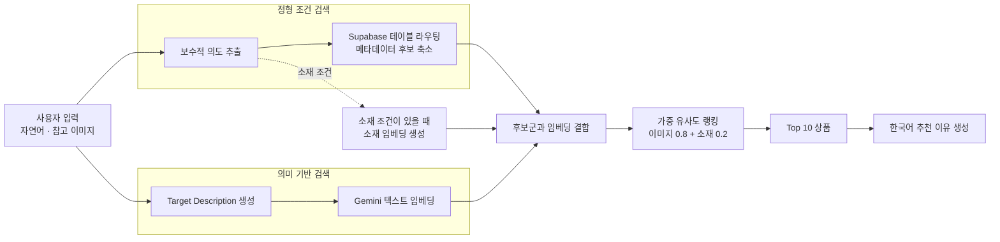

# F1T — Fashion Intention Translator

> 자연어 요청과 참고 이미지를 함께 해석해, 사용자가 원하는 조건에 가까운 패션 상품과 추천 이유를 제공하는 멀티모달 검색 시스템입니다.

<p align="center">
  
  
  
  
</p>

## 🛠️ 기술 스택

| 영역 | 기술 |
| --- | --- |
| Language | Python 3.11, TypeScript |
| Generative AI · VLM | Gemini 3.5 Flash, Google Gen AI SDK |
| Embedding · Retrieval | Gemini Embedding 2 (768차원), Cosine Similarity |
| Database · Vector DB | Supabase, PostgreSQL, pgvector |
| Backend | FastAPI, Uvicorn, Python Multipart |
| Frontend | React 19, TypeScript, Vite, Tailwind CSS 4 |

---

## 👗 프로젝트 소개

기존 패션 검색은 사용자가 상품명이나 카테고리를 정확히 알고 있다는 전제에 가깝습니다. F1T는 “출근할 때 입을 단정한 옷”, “이 사진과 비슷하지만 검은색인 재킷”처럼 **상황·스타일·참고 이미지가 섞인 요청**을 검색 가능한 조건으로 변환합니다.

- **텍스트 검색:** 자연어에서 사용자가 직접 언급한 카테고리, 색상, 소재, 스타일 등의 조건을 추출합니다.
- **이미지 + 텍스트 검색:** 참고 이미지의 시각적 특징과 추가 요청을 통합하되, 두 정보가 충돌하면 사용자가 명시한 텍스트 조건을 우선합니다.
- **19,833개 상품 검색:** 정형 메타데이터로 후보군을 먼저 줄인 뒤 임베딩 유사도로 순위를 계산합니다.
- **VLM 과잉 추론 억제:** 모델이 언급되지 않은 속성을 임의로 채우지 않도록 ‘언급 속성 식별’과 ‘속성값 추출’을 분리했습니다.

### 서비스 이용

- 운영 프론트엔드: [https://f1t-clean-front.vercel.app/](https://f1t-clean-front.vercel.app/)
- 프론트엔드 배포: Vercel
- 검색 API 배포: Cloudtype
- 상품·벡터 데이터베이스: Supabase PostgreSQL + pgvector

홈 화면이 열리면 프론트엔드는 검색 API의 `/health`를 미리 호출해 백엔드를 준비시킵니다. 검색 시점에 네트워크나 게이트웨이의 일시 오류가 발생하면 읽기 전용 검색 요청을 한 번 재시도하고, API를 사용할 수 없을 때는 Supabase 카탈로그 검색으로 전환해 기본 결과를 제공합니다.

## 🏆 주요 결과

| 항목 | 결과 |
| --- | ---: |
| 공학종합설계 | 우수작 선정 |
| 패션 상품 데이터 | 19,833개 |
| 평가 질의 | 102개 |
| Top-1 완전 적합 | 80건 (78.4%) |
| Top-1 부분 적합 포함 | 97건 (95.1%) |
| 평균 검색 후보 | 19,833개 → 2,707개 |
| 후보 축소율 | 86.35% |

> 정량 결과는 102개 질의에 대한 **Top-1 수동 적합도 평가**입니다. 완전 적합 80건, 부분 적합 17건, 실패 5건으로 분류했습니다.

## 🔄 추천 파이프라인



의도 추출과 Target Description 생성을 병렬로 수행하고, 정형 필터링과 임베딩 검색 결과를 결합해 최종 순위를 계산합니다.

## 🧠 핵심 기술 설계

### 1. 명시된 속성만 추출하는 2단계 의도 분석

VLM에 모든 속성값을 한 번에 생성하게 하면 사용자가 말하지 않은 색상·소재·스타일까지 추정하는 문제가 발생합니다. 이를 줄이기 위해 먼저 질의에 **명시된 속성의 종류**를 찾고, 다음 단계에서 해당 속성의 값만 추출합니다. 카테고리는 검색 테이블 선택에 필요하므로 문맥상 명확할 때만 제한적으로 도출합니다.

- 구현: [`pipeline/intent/intent_extraction.py`](pipeline/intent/intent_extraction.py)

### 2. 정형 메타데이터 기반 후보 축소

추출한 의도를 상품 DB의 카테고리별 Supabase 테이블과 연결합니다. 카테고리, 색상, 소재, 소매 등 정형 속성을 쿼리에 적용해 전체 상품을 직접 벡터 비교하지 않고 검색 대상부터 줄입니다.

- 구현: [`pipeline/retrieval/candidate_selection.py`](pipeline/retrieval/candidate_selection.py)

### 3. 텍스트 우선 멀티모달 Target Description

참고 이미지에서 보이는 특징과 자연어 요청을 하나의 검색 문장인 **Target Description**으로 통합합니다. 이미지와 텍스트가 충돌하면 “검은색으로 바꿔줘”처럼 사용자가 명시한 텍스트를 우선하고, 이미지에서 확인할 수 없는 특징은 임의로 추가하지 않습니다.

이 설계는 [Reason-before-Retrieve](https://openaccess.thecvf.com/content/CVPR2025/html/Tang_Reason-before-Retrieve_One-Stage_Reflective_Chain-of-Thoughts_for_Training-Free_Zero-Shot_Composed_Image_Retrieval_CVPR_2025_paper.html)의 검색 전 의미 재구성 아이디어를 참고했으며, 패션 속성 추출과 상품 검색 구조에 맞게 프롬프트와 파이프라인을 확장했습니다.

- 구현: [`pipeline/target_description/target_description_generation.py`](pipeline/target_description/target_description_generation.py)

### 4. 이미지·소재 임베딩 가중 랭킹

후보 상품의 이미지 임베딩과 Target Description 임베딩의 유사도를 기본 점수로 사용합니다. 소재 조건이 있는 경우에는 별도 소재 임베딩 유사도를 추가해 **이미지–Target Description 유사도 0.8 + 소재 유사도 0.2**로 최종 점수를 계산합니다. 소재 조건이 없으면 이미지 유사도만 사용합니다.

- 구현: [`pipeline/recommendation_service.py`](pipeline/recommendation_service.py), [`pipeline/retrieval/target_description_retrieval.py`](pipeline/retrieval/target_description_retrieval.py)

검색은 추출된 조건에 따라 두 경로 중 하나를 사용합니다.

| 경로 | 실행 조건 | 처리 방식 |
| --- | --- | --- |
| 메타데이터 우선 | 소매·기장·계절·핏처럼 정확히 비교할 속성이 있음 | Supabase REST로 후보를 좁힌 뒤 저장된 Gemini 벡터를 애플리케이션에서 재정렬 |
| 벡터 RPC | 정확한 후보가 없거나 메타데이터 조회가 실패함 | PostgreSQL RPC `match_fashion_items_768`이 이미지 HNSW 후보를 찾고 최종 점수를 계산 |

#### HNSW가 후보를 찾는 원리

상품 이미지와 검색 문장은 각각 **768개의 숫자로 이루어진 한 점**으로 표현됩니다. 인덱스가 없다면 질문 하나마다 약 2만 개 상품과 768개 숫자를 전부 비교해야 합니다. HNSW는 비슷한 점끼리 연결한 그래프를 여러 층으로 만들어 이 전체 비교를 줄입니다.

- 위층에는 멀리 이동하는 소수의 연결만 두어 검색 공간을 크게 건너뜁니다.
- 아래층으로 내려갈수록 더 많은 상품과 촘촘하게 연결됩니다.
- 각 층에서는 현재 위치보다 질문 벡터에 가까운 이웃으로 이동합니다.
- 가장 아래층에서 가까운 후보를 모은 뒤, 정확한 코사인 유사도로 순서를 계산합니다.

현재 RPC는 기본 Top 10 요청에서 테이블당 이미지 후보 50개를 탐색하고, 요청 결과 수가 커지면 후보를 최대 100개까지 늘립니다. 이 수는 HNSW 알고리즘의 고정 규칙이 아니라 프로젝트 함수에 정의된 값입니다.

```text
result_count    = 1~100 범위로 제한한 요청 결과 수
candidate_count = clamp(result_count × 5, 최소 50, 최대 100)
HNSW ef_search  = 100
```

`candidate_count`는 최종 재정렬에 남길 상품 수이고, `ef_search`는 HNSW가 내부에서 탐색할 수 있는 이웃 후보 폭입니다. 최종 응답에는 `result_count`개만 반환됩니다. 자세한 구현은 [`pipeline/README.md`](pipeline/README.md#hnsw-후보-검색과-재정렬)와 [`pipeline/sql/match_fashion_items_768.sql`](pipeline/sql/match_fashion_items_768.sql)에 정리했습니다.

### 5. 검색 근거를 보여주는 한국어 추천 이유

최종 상품 목록만 반환하지 않고 원문 질의, 추출 속성, Target Description, 상품 정보를 함께 사용해 한국어 추천 이유를 생성합니다. 사용자는 어떤 조건이 상품 선택에 반영됐는지 결과 화면에서 확인할 수 있습니다.

- 구현: [`pipeline/target_description/recommendation_explanation.py`](pipeline/target_description/recommendation_explanation.py)

## 📊 평가 방식

평가 질의 102개를 텍스트 질의와 이미지 포함 질의로 구성하고, 각 검색 결과의 첫 번째 상품이 요청 조건을 얼마나 충족하는지 수동으로 판정했습니다.

| 판정 | 기준 | 결과 |
| --- | --- | ---: |
| 완전 적합 | 핵심 조건을 모두 충족 | 80건 |
| 부분 적합 | 주요 조건은 충족하지만 일부 속성이 다름 | 17건 |
| 실패 | 핵심 조건을 충족하지 못함 | 5건 |

정형 필터링으로 평균 후보 수를 19,833개에서 2,707개로 줄여, 전체 상품을 매번 비교하지 않으면서도 부분 적합을 포함한 Top-1 적합률 95.1%를 기록했습니다.

## 👥 팀 구성 및 역할

| 이름 | 역할 | 담당 업무 |
| --- | --- | --- |
| **허원준** | **Team Leader** | 전체 코드 관리, Target Description 생성, 최종 검색·랭킹 및 추천 이유 파이프라인, 비용 관리 |
| 김상훈 | Team Member | 문서 관리, 테스트 질의 구성·시각 평가, 상품 데이터 크롤링 |
| 김재혁 | Team Member | 상품 DB 구축·관리, 메타데이터 정리, 이미지·소재 임베딩 구축 |
| 박주현 | Team Member | VLM 메타데이터 추출, 의도 기반 후보 필터링 설계, 프로젝트 진행 관리 |

## 📁 저장소 구조

```text
f1t_clean_publish/
├── backend/                    # FastAPI 엔드포인트와 요청·응답 처리
├── pipeline/
│   ├── intent/                 # 자연어 의도 및 명시 속성 추출
│   ├── retrieval/              # 후보 필터링과 임베딩 검색
│   ├── sql/                    # Supabase RPC 기준 SQL
│   ├── target_description/     # 검색 문장과 추천 이유 생성
│   ├── recommendation_service.py  # 전체 추천 파이프라인 오케스트레이션
│   └── vector_db_client.py     # 백엔드 전용 Supabase RPC 클라이언트
└── frontend/                   # React 기반 검색·결과 화면
```

배포용 스냅샷에는 런타임에 필요하지 않은 실험·원천 데이터 디렉터리가 포함되지 않습니다.

## ▶️ 실행 방법

### 1. 저장소 받기

```bash
cd <프로젝트를 받을 상위 폴더>
git clone https://github.com/cs-f1t/f1t_clean.git
cd f1t_clean
```

### 2. 백엔드 환경 구성

```bash
conda create -n f1t python=3.11 -y
conda activate f1t
pip install -r backend/requirements.txt
cp pipeline/.env.example pipeline/.env
```

[`pipeline/.env`](pipeline/.env.example)에 다음 환경변수를 설정합니다.

```env
GEMINI_API_KEY=
SUPABASE_URL=
SUPABASE_KEY=
FRONTEND_ORIGINS=http://localhost:5173
```

### 3. 프론트엔드 환경 구성

```bash
cd frontend
npm install
cp .env.example .env.local
cd ..
```

[`frontend/.env.local`](frontend/.env.example)에 다음 공개 설정값을 입력합니다.

```env
VITE_SUPABASE_URL=
VITE_SUPABASE_ANON_KEY=
VITE_API_BASE_URL=http://localhost:8000
```

### 4. 서버 실행

백엔드:

```bash
conda activate f1t
uvicorn backend.api:app --host 0.0.0.0 --port 8000
```

프론트엔드:

```bash
cd frontend
npm run dev -- --host 127.0.0.1 --port 5173
```

브라우저에서 `http://127.0.0.1:5173/`로 접속합니다. 모든 명령은 저장소 루트에서 시작한다고 가정합니다.

## 📚 참고 연구

- [Reason-before-Retrieve: One-Stage Reflective Chain-of-Thoughts for Training-Free Zero-Shot Composed Image Retrieval (CVPR 2025)](https://openaccess.thecvf.com/content/CVPR2025/html/Tang_Reason-before-Retrieve_One-Stage_Reflective_Chain-of-Thoughts_for_Training-Free_Zero-Shot_Composed_Image_Retrieval_CVPR_2025_paper.html)
