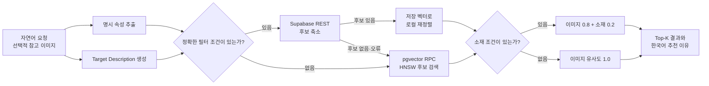

# F1T — Fashion Intention Translator

> 자연어와 참고 이미지를 함께 해석해 사용자의 조건에 가까운 패션 상품을 찾는 멀티모달 검색 프로젝트입니다.

<p align="center">
  <a href="https://f1t-clean-front.vercel.app/"></a>
  
  
  
</p>

<p align="center">
  <a href="https://f1t-clean-front.vercel.app/">Service</a> ·
  <a href="backend/README.md">Backend</a> ·
  <a href="pipeline/README.md">Pipeline</a> ·
  <a href="pipeline/benchmarks/README.md">Benchmark</a> ·
  <a href="frontend/README.md">Frontend</a>
</p>

## 프로젝트 요약

F1T는 상품명을 정확히 몰라도 상황, 스타일, 색상, 소재 같은 표현으로 19,833개 패션 상품을 검색할 수 있도록 설계한 공학종합설계 우수작입니다. 사용자의 문장에서 직접 언급된 조건은 메타데이터 필터로 후보를 줄이고, 참고 이미지와 문장은 하나의 Target Description으로 합쳐 임베딩 유사도 기반 재정렬에 사용합니다.

| 항목 | 결과 |
| --- | ---: |
| 패션 상품 데이터 | 19,833개 |
| 평가 질의 | 102개 |
| Top-1 완전 적합 | 80건 (78.4%) |
| Top-1 부분 적합 포함 | 97건 (95.1%) |
| 평균 검색 후보 | 19,833개 -> 2,707개 |
| 후보 축소율 | 86.35% |

평가 결과는 텍스트 질의와 이미지 포함 질의 102개에서 첫 번째 검색 결과를 수동으로 판정한 값입니다. 완전 적합 80건, 부분 적합 17건, 실패 5건으로 분류했습니다.

## 흐름과 설계



핵심 설계는 명시 속성 추출과 속성값 추출을 분리하는 데 있습니다. VLM이 사용자가 말하지 않은 속성을 채우는 문제를 줄이기 위해 먼저 언급된 속성의 종류를 식별하고, 해당 속성의 값만 추출합니다. 소매, 기장, 성별, 계절, 신축성, 두께, 핏은 Supabase 메타데이터 필터에 사용하고 색상과 소재는 Target Description과 임베딩 점수에 반영합니다.

이미지·소재 임베딩 재정렬은 `이미지 0.8 + 소재 0.2` 가중치를 사용합니다. 소재 조건이 없으면 이미지 유사도만 사용하며, 참고 이미지와 텍스트가 충돌하면 사용자가 명시한 텍스트 조건을 우선합니다.

## 개인 기여

팀 리더로서 백엔드와 검색 파이프라인 통합, Target Description 생성 경로, 메타데이터 후보 축소, 벡터 검색, 이미지·소재 가중 랭킹, 한국어 추천 이유 생성, 배포 구조와 운영 DB 벡터 용량 정책을 담당했습니다.

| 이름 | 역할 | 담당 영역 |
| --- | --- | --- |
| 허원준 | Team Leader | 파이프라인 통합, Target Description, 검색·랭킹, 추천 이유, 비용 관리 |
| 김상훈 | Team Member | 문서, 평가 질의 구성, 시각 평가, 상품 데이터 크롤링 |
| 김재혁 | Team Member | 상품 DB, 메타데이터, 이미지·소재 임베딩 구축 |
| 박주현 | Team Member | VLM 메타데이터 추출, 후보 필터링 설계, 프로젝트 진행 관리 |

## 기술 스택

| 영역 | 기술 |
| --- | --- |
| Language | Python 3.11, TypeScript |
| VLM | Gemini 3.5 Flash, Google Gen AI SDK |
| Embedding and Retrieval | Gemini Embedding 2, 768 dimensions, cosine similarity |
| Database | Supabase, PostgreSQL, pgvector, HNSW |
| Backend | FastAPI, Uvicorn |
| Frontend | React 19, Vite, Tailwind CSS 4 |
| Deployment | Vercel, Cloudtype |

## 실행과 검증

```bash
git clone https://github.com/cs-f1t/f1t.git
cd f1t

conda create -n f1t python=3.11 -y
conda activate f1t
pip install -r backend/requirements.txt
cp pipeline/.env.example pipeline/.env
```

`pipeline/.env`에 백엔드 설정을 입력합니다.

```env
GEMINI_API_KEY=
SUPABASE_URL=
SUPABASE_KEY=
FRONTEND_ORIGINS=http://localhost:5173
```

백엔드와 프론트엔드를 실행합니다.

```bash
uvicorn backend.api:app --host 0.0.0.0 --port 8000

cd frontend
npm install
cp .env.example .env.local
npm run dev -- --host 127.0.0.1 --port 5173
```

검증 명령은 다음과 같습니다.

```bash
python -m pytest -q
python -m pipeline.benchmarks.search_latency \
  pipeline/tests/intent_analysis_results.json \
  pipeline/tests/simple_test/simple_test_results_gemini.json \
  pipeline/tests/simple_test/image_test_results_gemini.json \
  --expected-count 54 \
  --strict-count \
  --dry-run

cd frontend
npm run lint
npm run build
```

## 참고 자료

- 정량 결과는 102개 질의의 Top-1 결과를 수동 판정한 프로젝트 내부 평가입니다. 자동 벤치마크나 통계적 유의성 검증 결과는 아닙니다.
- 로컬 검색에는 Gemini API와 Supabase 프로젝트가 필요합니다.
- 운영 데모는 Vercel, Cloudtype, Supabase 상태와 사용량 제한의 영향을 받을 수 있습니다.
- 운영 DB에는 검색에 사용하는 Gemini 이미지·소재 임베딩만 유지합니다. 실험용 벡터 정리 기준은 [pipeline/README.md](pipeline/README.md#운영-db-용량-정책)를 참고하세요.
- [Reason-before-Retrieve: One-Stage Reflective Chain-of-Thoughts for Training-Free Zero-Shot Composed Image Retrieval (CVPR 2025)](https://openaccess.thecvf.com/content/CVPR2025/html/Tang_Reason-before-Retrieve_One-Stage_Reflective_Chain-of-Thoughts_for_Training-Free_Zero-Shot_Composed_Image_Retrieval_CVPR_2025_paper.html)
